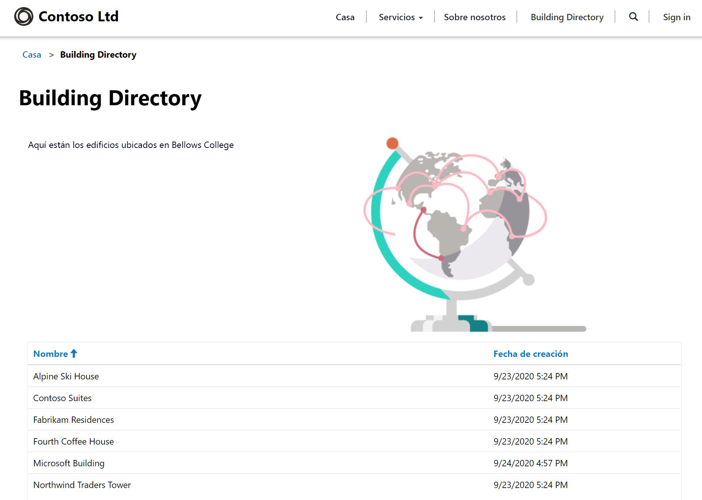

---
lab:
    title: 'Laboratorio 5: Cómo crear un portal de Power Apps'
    module: 'Módulo 3: Comenzar con Power Apps'
---

# Módulo 3: Comenzar con Power Apps

## Laboratorio 4: Cómo crear un portal de Power Apps

# Escenario

Bellows College es una institución educativa que tiene un campus con varios edificios. Actualmente se guarda un registro físico de las visitas al campus. La información no se recaba de manera uniforme y no hay forma de recopilar y analizar los datos sobre las visitas de todo el campus.

La administración del campus desea proporcionarles a los visitantes información sobre los edificios del campus. Los visitantes podrán ver la lista de edificios en un sitio web, que se creará utilizando un portal de Power Apps.

En este laboratorio, aprovisionará un portal de Power Apps y creará una página web de portales que mostrará una lista de los edificios del campus.

# Pasos de alto nivel del laboratorio

Seguirá el siguiente esquema para diseñar el portal de Power Apps:

* Aprovisionar un portal de Power Apps en el entorno de Common Data Service
* Crear y configurar una página web para mostrar una lista de los edificios
* Crear un tema nuevo y aplicarlo al portal

## Requisitos previos

* Finalización del **Módulo 0 Laboratorio 0: Validación del entorno de laboratorio**
* Finalización del **Módulo 2 Laboratorio 1: Introducción a Common Data Service**

## Cuestiones que tener en cuenta antes de comenzar

* Las aplicaciones de los portales de Power Apps siempre se inician desde una plantilla en lugar de una aplicación en blanco. Una vez que aprovisione un portal, ya tendrá páginas, menús y un tema predeterminado.

# Ejercicio 1: Aprovisionar un portal de Power Apps

**Objetivo:** En este ejercicio, aprovisionará un portal de Power Apps en su entorno al que podrá acceder desde cualquier lugar de la World Wide Web.

## Tarea 1: Aprovisionar un portal de Power Apps

1.  Cree una nueva aplicación de portal.

    -   Inicie sesión en <https://make.powerapps.com>

    -   Si el **Entorno** que se muestra en la parte superior derecha no es su Entorno de práctica, seleccione su Entorno.

    -   Haga clic en el panel **Portal en blanco**, debajo de **Crea tu propia aplicación**.

2.  Proporcione nuevos detalles del portal.

    -   Escriba **Visitantes de Bellows College** como **Nombre** del portal.

    -   Proporcione una URL única: **algo**.powerappsportals.com (si el nombre ya está en uso, elija uno diferente).

    -   Seleccione un **Idioma** base para el portal.

    -   Haga clic en **Crear**.

3. El proceso de aprovisionamiento del portal se ejecutará entre 30 y 45 minutos.  Tenga paciencia.

Tarea 2: Ir al portal
--------------------------------

1.  Recibirá una notificación en <https://make.powerapps.com> cuando el portal haya sido aprovisionado.

2.  Abra el nuevo portal.

    -   Haga clic en **Aplicaciones**.

    -   Busque la aplicación que tiene el **Tipo** de **Portal**.

    -   Haga clic en el nombre de la aplicación.

3.  Debería ser redirigido a un sitio web del portal con la página de aterrizaje con un mensaje de bienvenida.

Ejercicio 2: Crear una página web de portal
===============================

**Objetivo:** En este ejercicio, creará una nueva página web que mostrará contenido estático, así como una lista de edificios de Common Data Service.

Tarea 1: Crear una página web
--------------------------------

1.  Abrir portales de Power Apps Studio

    -   Inicie sesión en <https://make.powerapps.com> (todavía puede tener esto abierto en sus pestañas)

    -   Busque la aplicación que tiene el **Tipo** de **Portal**.

    -   Haga clic en los puntos suspensivos (**...**) y elija **Editar**

2.  Ahora se encuentra en los portales de Power Apps Studio. Aquí es donde puede modificar y crear contenido del portal.

3.  Crear una nueva página.

    -   En la barra de comandos, seleccione **Nueva página.**

    -   Sitúe el ratón sobre **Diseños fijos** y elija **Página con título**

4.  Modificar las propiedades de la página

    -   En el panel Propiedades, en **Mostrar**, cambie el **Nombre** desde **Página nueva (1)** a **Directorio de edificios**, presione la tecla Tab (para iniciar el guardado automático)

    -   El título de la página ahora debería leerse **Directorio de edificios**

    -   En **URL parcial**, cambie el valor a **directorio-edificio**y presione la tecla Tab (para iniciar el guardado automático)

Tarea 2: Agregar contenido estático
--------------------------------

1.  Agregue una sección a la página web

    -   En el lienzo (área que muestra la página web), seleccione la sección **Copia de página**. Es el cuadro grande alrededor de las 2 frases de texto en el medio de su página.

    -   En el cinturón de herramientas (lado izquierdo), seleccione el icono**Componentes**

    -   Escoja **Sección de dos columnas** desde el área **Diseño de sección**

2.  Agregar texto estático

    -   En el lienzo (área que muestra la página web), seleccione la columna de la izquierda

    -   En el cinturón de herramientas (lado izquierdo), seleccione el icono**Componentes**

    -   Escoja **Texto** desde el área **Componentes del portal**

    -   En la nueva área de texto, escriba lo siguiente:
          ```
          Lo que viene a continuación es el directorio de edificios.
          ```
    -   Seleccione el cuadro de texto sobre el que acaba de editar y haga clic en **Eliminar** en la barra de comandos para eliminar el texto predeterminado.

3. Agregar una imagen

    -   En el lienzo (área que muestra la página web), seleccione la columna de la derecha

    -   En el cinturón de herramientas (lado izquierdo), seleccione el icono **Componentes**

    -   Elija **Imagen** desde el área **Componentes del portal**

    -   En el panel Propiedades, haga clic en **Seleccionar una imagen**. Busque y seleccione el **Producto A.png**
    
    -   En el panel Propiedades, haga clic en el menú desplegable de la sección Formato y cambie la **Anchura** al 70 % (asegúrese de escribir el %). Puede jugar con el tamaño de la imagen hasta que quede como desee.

4.  Haga clic en **Navegar por el sitio web** para ver la página hasta ahora.  Fíjese que está la opción **Directorio de edificios** en el menú principal.

Tarea 3: Agregar un componente de lista
--------------------------------

1.  Abrir portales de Power Apps Studio

    -   Inicie sesión en <https://make.powerapps.com> (todavía puede tener esto abierto en sus pestañas)

    -   Busque la aplicación que tiene el **Tipo** de **Portal**.

    -   Haga clic en los puntos suspensivos (**...**) y elija **Editar**
    
2.  Edite la página existente que creó anteriormente

    -   En el cinturón de herramientas (lado izquierdo), elija la opción **Páginas** 

    -   Busque y seleccione la página **Directorio de edificios** que creó anteriormente
    
3.  Agregar un componente de lista

    -   En el cinturón de herramientas (lado izquierdo), seleccione el icono**Componentes**

    -   Elija **Sección de una columna** desde el área **Diseño de sección** (aparecerá una sección debajo de la imagen y el texto en la página web)

    -   Seleccione la nueva sección de columna en el lienzo

    -   En el cinturón de herramientas (lado izquierdo), seleccione el icono**Componentes**

    -   Elija **Lista** desde el área **Componentes del portal** (aparecerá un componente de lista en la nueva sección)
    
4.  Configure el componente de lista

    -   Seleccionar el componente de lista en el lienzo

    -   En el panel Propiedades (lado derecho), escriba **Lista de edificios** en el campo **Nombre**

    -   En el campo **Entidad**, seleccione **Edificios** de la lista desplegable.

    -   En **Vistas**, elija **Edificios activos**

    -   Deje la configuración predeterminada restante
    
5.  Haga clic en **Navegar por el sitio web** para ver la página. Debería ver la lista de Edificios de Common Data Service aparecer en la página web.

Ejercicio 3: Cambiar el tema del portal
===============================

**Objetivo:** En este ejercicio, creará un nuevo tema que alterará el esquema de color de su portal. 

Tarea 1: Aplicar y editar un tema
--------------------------------

1.  Abrir portales de Power Apps Studio

    -   Inicie sesión en <https://make.powerapps.com> (todavía puede tener esto abierto en sus pestañas)

    -   Busque la aplicación que tiene el **Tipo** de **Portal**.

    -   Haga clic en los puntos suspensivos (**...**) y elija **Editar**
    
2.  Aplicar y personalizar un tema básico

    -   En el cinturón de herramientas (lado izquierdo), seleccione el icono**Componentes**
    
    -   Haga clic en la alternancia **Habilitar tema básico** para activar esta característica.
    
    -   En uno de los ajustes preestablecidos, haga clic en los puntos suspensivos(**...**) y elija **Personalizar**
    
    -   Se ha creado una copia del tema básico. 
    
    -   En el panel Propiedades, pruebe cambiar los colores y explore el impacto de estos cambios en el portal.
    
    -   Cambiar el nombre de su tema
    
3.  Guardar los cambios

    -   En la barra de comandos, haga clic en **Sincronizar configuración**


El diseño de la aplicación debería ser similar a la estructura siguiente:



# Desafíos

* Cree una vista diferente de edificios que solo muestre el nombre del edificio. Necesitará seleccionar **Navegar por el sitio web** desde el portal Studio para ver los cambios.
* En el cinturón de herramientas, haga clic en el icono **Temas** y edite el CSS del tema personalizado.
* Cree una página con el componente **Formulario** y modifique un componente de **Lista** para agregar o editar registros de Common Data Service con el formulario.
* Habilite **Permisos de entidad** en **Configuración** de un componente **Lista**. ¿Qué pasa con los datos?
* En el portal de Studio, seleccione el icono del Editor de código fuente `</>` para ver el origen de la página. Si se siente cómodo con HTML, haga algunas modificaciones y vea los resultados.
